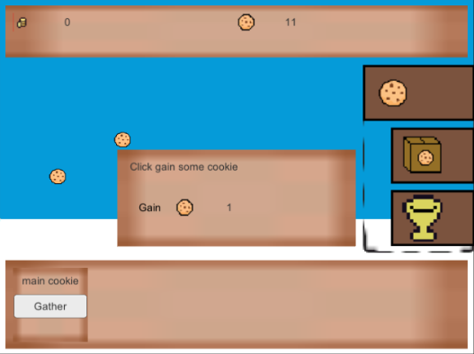
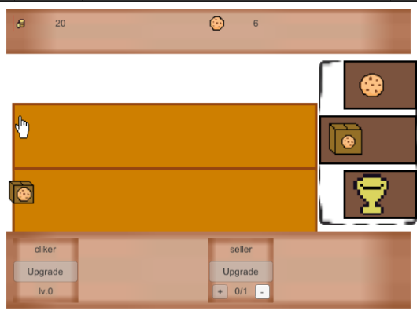
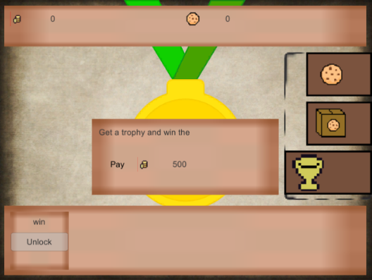

## 项目

- 一个Unity放置游戏框架，可基于此框架开发任意主题的放置游戏。
- 基于此框架，饼干为主题，得到的放置游戏。

该框架还有Libgdx引擎(java)版本[hundun-idle-all项目](https://github.com/hundun000/hundun-idle-all)，且Unity版翻译自Libgdx版，故Unity版代码架构和风格会比较奇怪。

## 游戏概念一览

### 资源

实例：饼干、金钱

### buff

实例：胜利

一般情况放置游戏没有胜利的概念，demo中的“胜利”可以看成“购买了一个奖杯，获得名为胜利的buff”，该buff也没有增益，仅用于触发成就。

demo里也不含有能展示已有buff的UI。

### 成就

实例：获得胜利

每个成就可设置达成条件为需要达成多少资源/多少buff。“获得胜利”成就的触发条件即为“胜利”buff等级达到1。

demo里，获得成就时将弹窗提示。

### 设施

设施的行为包括：

- 点击触发：消耗资源,获得另一种资源或获得buff
- 自动触发：消耗资源,获得另一种资源
- 升级：可在等级范围内调整启用等级
- 调整启用等级：自动触发的消耗和产出受启用等级影响

实例：大饼干，手指，出售器，奖杯购买处。

- 大饼干    点击触发：无消耗，获得1个饼干；升级：不可；
- 手指    自动触发：无消耗，获得（1 * level）个饼干；升级：可，上限5；
- 出售器    自动触发：消耗（1 * level）个饼干，获得（5 * level）个金钱；升级：可，上限5；
- 奖杯购买处    不可触发；升级：消耗500个金钱，获得一层“胜利”buff，上限1；

### 区域

实例：饼干区，设施区，奖杯区

玩家在“区域控制面板”可切换区域。

每个区域可配置其：
- 展示的设施类型
- 展示的GameEntity类型，及其位置和移动方式（下落的饼干，排成一列的手指和箱子）
- （在“资源面板”上）展示的资源类型（一般都展示所有资源类型）

### 存档

游戏关闭时会自动存档。存档位于:

Windows `%userprofile%\AppData\LocalLow\DefaultCompany\Unity-IdleDemo`

## 代码架构

### 子项目

- Assets\Scripts\HundunLib

一种自创的框架。姑且称为HundunLib框架。可基于HundunLib框架开发任意类型的游戏。

- Assets\Scripts\IdleShare

基于HundunLib框架，加入放置游戏的基础代码。姑且称为IdleShare框架。可基于IdleShare框架开发任意主题的放置游戏。

- Assets\Scripts\DemoGameCore

基于IdleShare框架，饼干为主题，得到的放置游戏。

### 新游戏开发

仿照DemoGameCore，创建新的YouGameCore子项目，并依赖IdleShare和HundunLib。